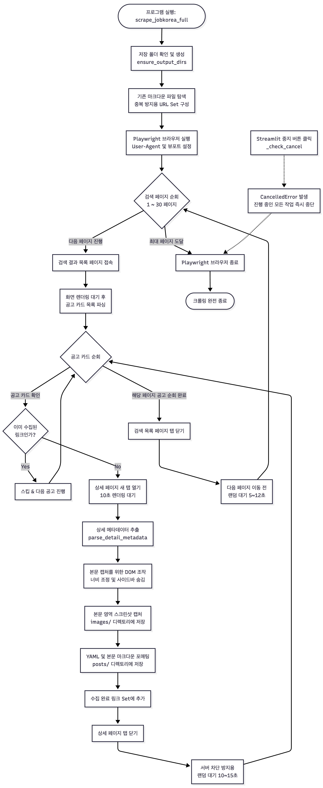

# 프로젝트

잡코리아 공고를 수집합니다.

1. 실행에는 docker가 필요하므로, docker 먼저 설치해 주세요

2. 프로젝트 최상위 폴더에서 `docker compose up --build streamlit` 명령을 실행하면 0.0.0.0:8501 주소로 app.py가 실행됩니다.

3. 위 주소를 브라우저로 입력해 진입합니다.

4. 수집 버튼을 누르면 공고가 "/data" 하위 경로에 수집됩니다.

5. 수집 속도, 파싱 등은  scraper.py에서 조정할 수 있습니다. (수집 속도를 너무 빠르게 올리면 차단 위험이 있어 권장하지 않습니다.)

## 프로젝트 영상

## 워크플로우
